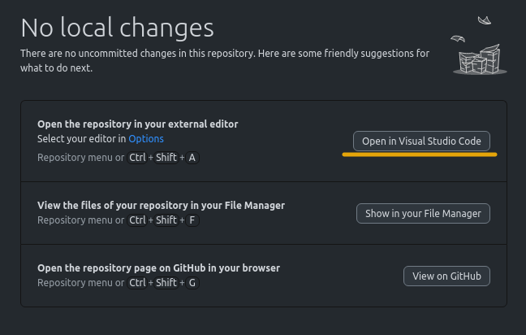
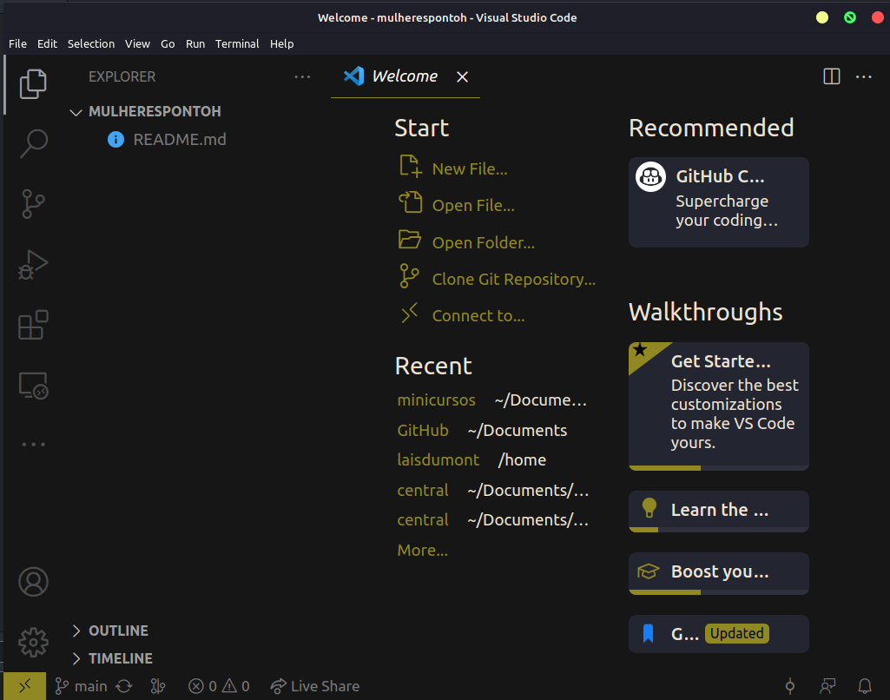
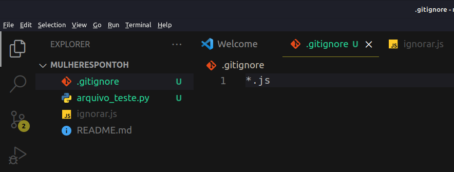
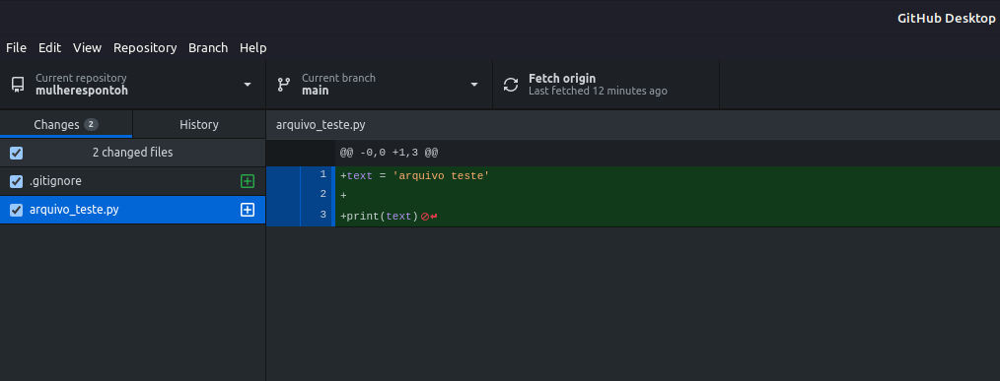

# Alterando um repositório

Após clonar o repositório você poderar fazer as alterações que desejar (excluir ou incluir dados). A seguir mostraremos como fazer isso por meio do GitHub Desktop e pelo Visual Studio Code.

**Passo 1: Instale o vscode na sua máquina**

- Você poderá instalar o vscode seguindo os passos presentes no link: [Visual Studio Code](instalando_o_vscode.md).

**Passo 2: Abra o VSCODE pelo GitHub Desktop**

- No repositório que você criou selecione o botão **Abrir no Visual Studio Code**.

**Passo 3: Edite e crie no vscode**

- Agora aparecerá uma a tela do vscode com opções de criar e editar arquivos no repositório, aproveite para aprender explorando as funcionalidades do vscode.

## Extra

- No github crie a pasta `.gitignore`, lá você poderá colocar os arquivos ou tipos de arquivos que você não enviará para o repositório no commit/push.

- No arquivo abaixo o `*.js` do `.gitignore` faz com que todos os arquivos do tipo js sejam ignorados, para ignorar apenas um arquivo colocamos o nome do arquivo (nesse caso colocaríamos `ignorar.js`) no `.gitignore`.

- A imagem abaixo mostra as mudanças do repositório sem a presença do arquivo javascript.

