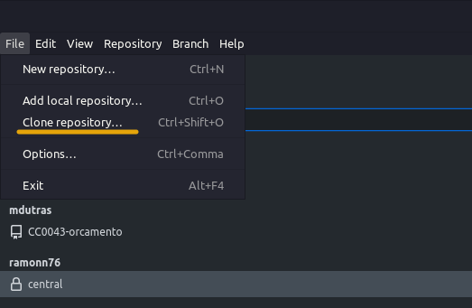
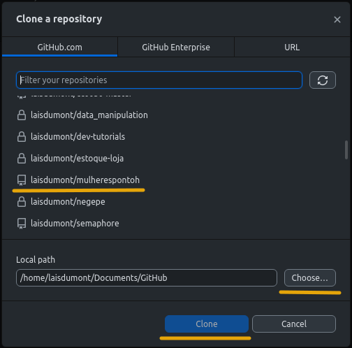
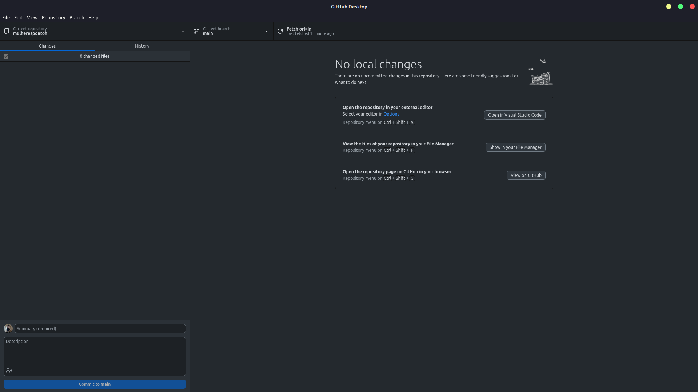

# Clonando um repositório

 A clonagem permite que você tenha uma cópia local do repositório em seu sistema para trabalhar com os arquivos e fazer alterações. Nessa abordagem traremos a clonagem do repositório feita pelo GitHub desktop.

**Passo 1: Baixe e Instale o GitHub Desktop**

- Acesse o site oficial do GitHub Desktop em https://desktop.github.com/.
Baixe o instalador para o seu sistema operacional e siga as instruções para instalá-lo. Se você estiver utilizando o linux, você pode instalar por linha de código ou pela loja de aplicativos presentes no sistema.

**Passo 2: Efetue o Login na Sua Conta do GitHub**

- No repositório que você criou selecione o botão *&Abrir no Visual Studio Code**
- Abra o GitHub Desktop após a instalação.
Se você ainda não estiver conectado à sua conta do GitHub, clique em "Sign in to GitHub.com" e faça login usando suas credenciais.

**Passo 3: Clone um Repositório**

- Clique no botão "File" (Arquivo) no canto superior esquerdo e selecione "Clone Repository" (Clonar repositório).

- Você verá uma lista de repositórios disponíveis em sua conta do GitHub. Selecione o repositório que deseja clonar.

- Escolha o diretório local onde deseja clonar o repositório. Isso é onde os arquivos do repositório serão armazenados em seu computador.

- Clique no botão "Clone" para iniciar o processo de clonagem.

**Passo 4: Acesse o Repositório Clonado**

- Após a clonagem ser concluída, você verá uma entrada para o repositório clonado na tela principal do GitHub Desktop.
Clique no repositório clonado para abrir a visualização detalhada.

- Nele você terá a opção de abrir o arquivo no *vscode* para manipular o código, ver a pasta onde o arquivo foi clonado e no no GitHub online.