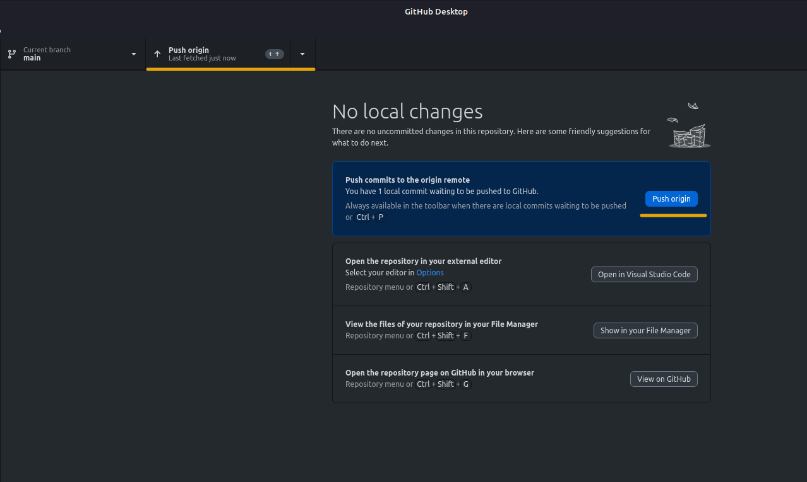

# Commit e Push no GitHub

**Passo 1: Abra o Repositório no GitHub Desktop**

- Abra o GitHub Desktop.

- Na tela principal, selecione o repositório no qual você deseja fazer um commit e push.

**Passo 2: Faça Suas Alterações**

- Na seção "Changes" (Alterações) do GitHub Desktop, você verá uma lista de arquivos modificados. As alterações que você fizer serão listadas aqui.

- Selecione as caixas ao lado dos arquivos modificados para escolher quais alterações deseja incluir no próximo commit. Os arquivos que não estão marcados não serão "commitados".

**Passo 3: Descreva o Commit**

- Abaixo da lista de alterações, há um campo de texto chamado "Summary" (Resumo). Digite um resumo curto e descritivo do que foi alterado.

- Se desejar, você também pode adicionar uma descrição mais detalhada no campo "Description" (Descrição).

**Passo 4: Faça o Commit**

- Clique no botão "Commit to main" (Fazer commit para main) ou "Commit to <nome_da_branch>" (Fazer commit para <nome_da_branch>), dependendo da branch em que você está trabalhando.

**Passo 5: Realize o Push**

- Após fazer o commit, o GitHub Desktop exibirá um botão "Push origin" (Enviar para o origin) ou "Push to <nome_da_branch>" (Enviar para <nome_da_branch>), dependendo da branch.

- Clique no botão "Push" para enviar as alterações para o repositório remoto no GitHub.

**Passo 6: Autenticação**

- Se você não estiver autenticado, o GitHub Desktop solicitará suas credenciais do GitHub.

- Insira suas credenciais para autenticar e permitir o envio das alterações.

**Passo 7: Sincronização Concluída**

Após o processo de push ser concluído, suas alterações serão refletidas no repositório remoto no GitHub.

Isso completa o processo de fazer um commit e push usando o GitHub Desktop.