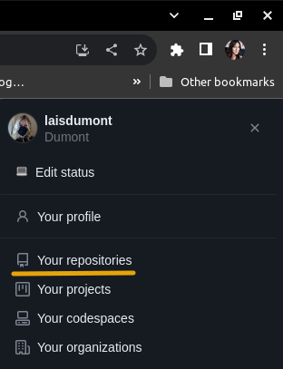
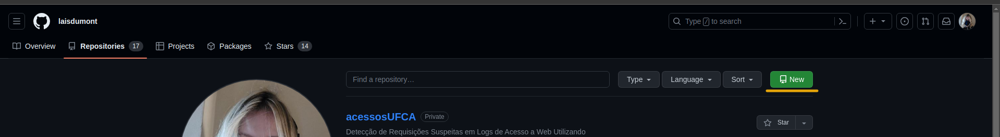
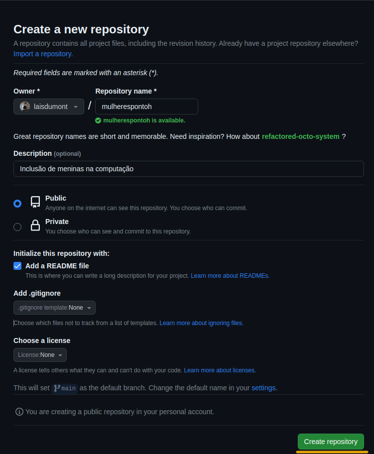
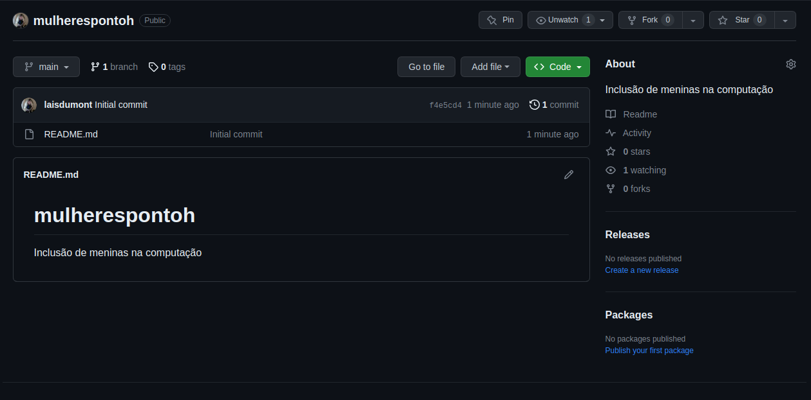

# Criando um repositório

Criar um repositório no GitHub significa criar um espaço virtual onde você pode armazenar, gerenciar e colaborar em projetos de software, documentação ou qualquer outro tipo de conteúdo. Um repositório é essencialmente uma pasta que contém seus arquivos, histórico de alterações (através do sistema de controle de versão Git) e informações sobre colaboradores e contribuições.

Ao criar um repositório no GitHub, você está estabelecendo um local centralizado para desenvolver, compartilhar e controlar as mudanças em seu projeto. Isso facilita o trabalho em equipe, o rastreamento de alterações, a resolução de conflitos e o compartilhamento do progresso com outras pessoas. 

## Veremos em alguns passos de como criar um repositório:

**Passo 1: Efetue o login na sua conta GitHub**

Acesse https://github.com/ e faça o login na sua conta.

**Passo 2: Acesse a página inicial do seu perfil**

Após efetuar o login, você será redirecionado para a página inicial do GitHub. Clique na sua foto de perfil no canto superior direito e selecione "Your repositories" (Seus repositórios) no menu suspenso. Isso o levará à página onde você pode ver todos os seus repositórios existentes.

**Passo 3: Crie um novo repositório**

Na página "Your repositories", clique no botão verde "New" (Novo) localizado no canto superior direito.

**Passo 4: Preencha as informações do repositório**

Aqui você precisará fornecer detalhes sobre o novo repositório:

- **Repository name** (Nome do repositório): Escolha um nome descritivo para o seu repositório.
- **Description** (Descrição): Adicione uma breve descrição sobre o objetivo do repositório (opcional, mas recomendado).
- **Visibility** (Visibilidade): Escolha entre público (public) ou privado (private). Repositórios públicos podem ser vistos por qualquer pessoa, enquanto repositórios privados são visíveis apenas para você e colaboradores que você convidar.
- **Initialize this repository with** (Inicialize este repositório com): Você pode optar por iniciar o repositório com um arquivo README, o que é uma boa prática, ou adicionar um arquivo .gitignore para especificar quais tipos de arquivos devem ser ignorados pelo Git. Você também pode escolher uma licença para o seu projeto.

**Clique em "Create repository"**

Após preencher as informações necessárias, role para baixo e clique no botão verde "Create repository". Seu novo repositório será criado e você será redirecionado para a página do repositório.

